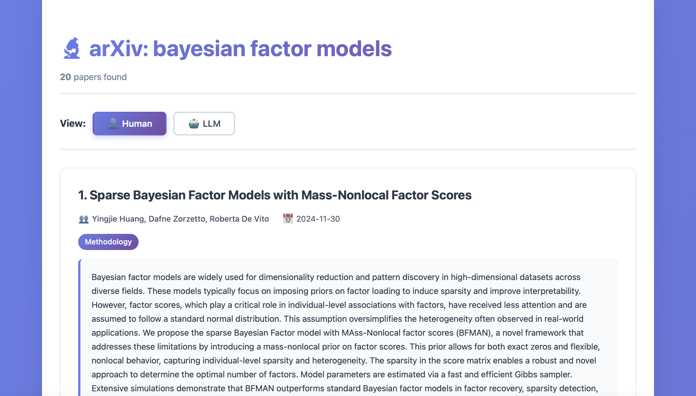

# 🔬 renderarxiv



Search arXiv from your terminal and get beautiful HTML results you can read or copy-paste into ChatGPT/Claude.

No more hallucinated papers — everything is real, straight from arXiv.


---

## 📥 Install

```bash
pip install git+https://github.com/peterdunson/renderarxiv.git
```

That's it!

---

## 🚀 Use

```bash
renderarxiv "transformer attention mechanism"
```

Opens a beautiful HTML page in your browser with:
- 👤 **Human view** — clean paper cards with abstracts, authors, PDF links
- 🤖 **LLM view** — formatted text ready to copy into AI assistants

---

## ⚙️ Options

**Get more/fewer results:**
```bash
renderarxiv "quantum computing" --max-results 15
```

**Ranking modes:**
```bash
renderarxiv "deep learning" --mode recent      # Newest papers
renderarxiv "neural networks" --mode relevant  # Best text match
renderarxiv "language models" --mode semantic  # Smart semantic matching
```

Default is `balanced` (mix of relevance + recency).

**Filter by category:**
```bash
renderarxiv "object detection" --category cs.CV  # Computer Vision only
renderarxiv "optimization" --category math.OC    # Math only
```

Common categories: `cs.LG` (ML), `cs.AI` (AI), `cs.CL` (NLP), `cs.CV` (Vision), `cs.RO` (Robotics)

**Save to file:**
```bash
renderarxiv "diffusion models" -o papers.html --no-open
```

---

## 💡 Examples

```bash
# Latest ML research
renderarxiv "large language models" --category cs.LG --mode recent

# Find a specific paper
renderarxiv "attention is all you need" --mode relevant

# Explore robotics
renderarxiv "robot manipulation" --category cs.RO --max-results 20

# Deep semantic search
renderarxiv "few-shot learning" --mode semantic
```

---

## 🎯 Pro Tip

1. Search for papers: `renderarxiv "your topic" --max-results 10`
2. Click the **🤖 LLM** button in your browser
3. Copy the text (Ctrl+A, Ctrl+C)
4. Paste into ChatGPT/Claude: *"Summarize these papers and identify key trends"*

Now your AI has real citations, not hallucinations!

---

## 📚 Full Category List

**Computer Science:**
- `cs.AI` — Artificial Intelligence
- `cs.CL` — Natural Language Processing
- `cs.CV` — Computer Vision
- `cs.LG` — Machine Learning
- `cs.RO` — Robotics
- `cs.CR` — Security
- `cs.SE` — Software Engineering

**Math/Stats:**
- `math.OC` — Optimization
- `stat.ML` — Statistics/ML

**Physics:**
- `quant-ph` — Quantum Physics

Full list: https://arxiv.org/category_taxonomy

---

## 🤔 Why use this?

- ✅ No hallucinated papers
- ✅ Direct PDF download links
- ✅ Beautiful, readable output
- ✅ LLM-ready formatted text
- ✅ Fast (uses official arXiv API)
- ✅ Filter by research area
- ✅ Multiple ranking modes

---

## 🛠️ Development

```bash
git clone https://github.com/peterdunson/renderarxiv.git
cd renderarxiv
pip install -e .
```

---

## 📄 License

MIT © 2025

---

## 🙏 Inspired by

- [rendergit](https://github.com/karpathy/rendergit) by Andrej Karpathy
- [renderscholar](https://github.com/peterdunson/renderscholar)
- [renderstack](https://github.com/peterdunson/renderstack)
